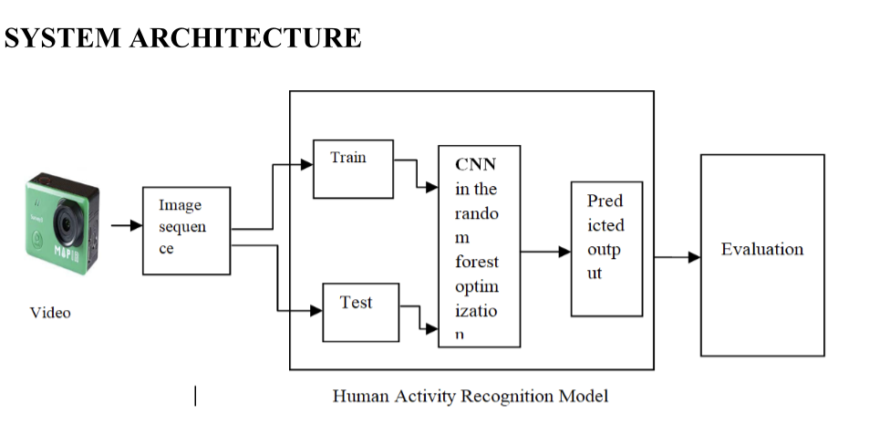
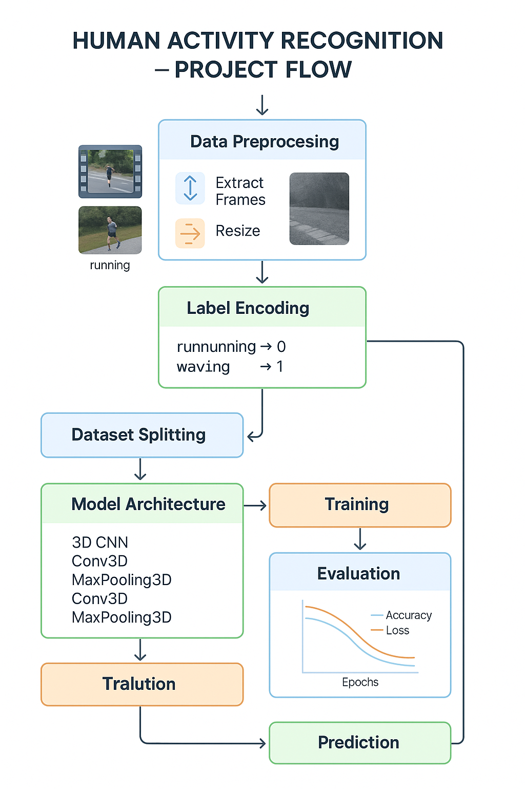
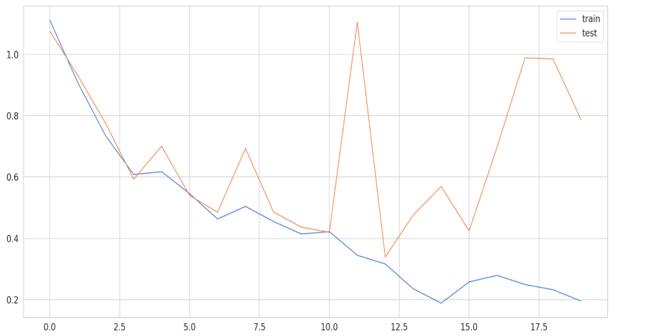
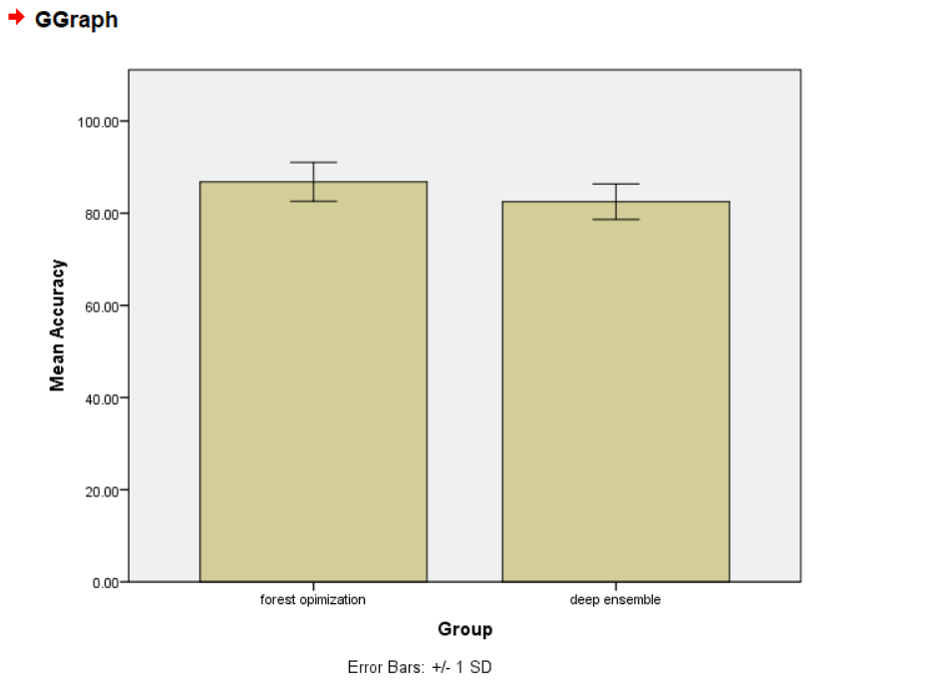

📚 Human Activity Recognition - Project Summary

🔍 Introduction
This project focuses on Human Activity Recognition (HAR) using deep learning techniques, primarily Convolutional Neural Networks (CNNs). The goal is to automatically recognize different human activities from video frames, enabling applications in surveillance, healthcare, and smart environments.
🎯 Project Objectives
To build a deep learning model for recognizing human activities from videos.

To preprocess video data and create a clean input pipeline.

To evaluate the model's performance using accuracy, loss, and confusion matrix.

🛠️ Project Workflow

Main Steps:

Data Collection

Preprocessing (frame extraction, resizing, normalization)

Label Encoding

Dataset Splitting (Train, Validation, Test)

Model Building (Conv3D Architecture)

Model Training

Evaluation and Prediction
📊 Results
Model Accuracy: 96%
significance P value =0.00
Confusion Matrix:

🏆 Publications
Research Paper: "Comparative Assessment of Forest Optimization with Deep Ensembling Technique for Human Activity Recognition Based on Data Collected from Wearable Devices".
Published in: GeInTEC - Revista de Gestão e Tecnologia
View Paper: https://revistageintec.net/old/article/comparative-assessment-of-forest-optimization-with-deep-ensembling-technique-for-human-activity-recognition-based-on-data-collected-from-wearable-devices/index.html.

Conference Presentation:
Title: "Comparative assessment of forest optimization with novel deep ensembling technique for human activity recognition based on data collected from smartphones".
Presented at: AIP Conference Proceedings
View Paper: https://pubs.aip.org/aip/acp/article-abstract/2729/1/060021/3262440/Comparative-assessment-of-forest-optimization-with?redirectedFrom=fulltext
⚠️ Disclaimer
Note:
Due to dataset licensing and academic project restrictions, the dataset and full source code are not publicly shared in this repository.
This repository serves to present the project overview, workflow, results, and publication links.

🚀 Future Work
Extending the model to recognize complex multi-person activities.

Improving model accuracy using transformer-based architectures.

Publishing additional results and extended datasets when permitted.

Thank you! 🌟
For any questions or collaborations, feel free to connect!

